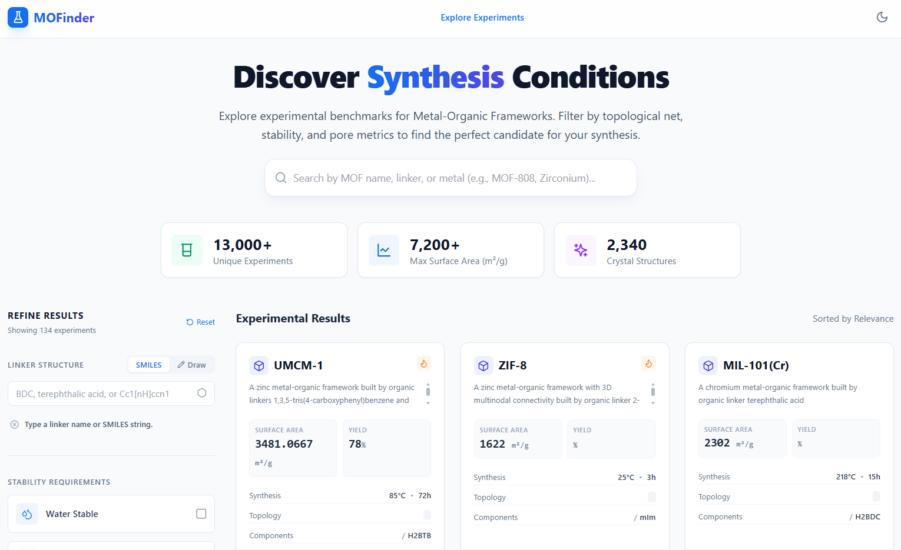
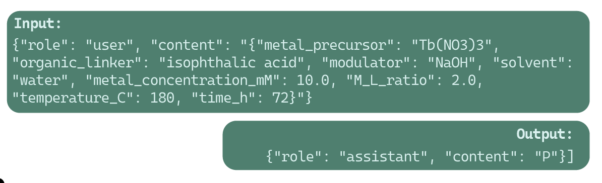

# MOFinder

MOFinder extracts MOF synthesis information from the literature, reconstructs evidence-supported negative reaction records, and prepares datasets for synthesis-outcome prediction.

<p align="center">
  
</p>

[Web application](https://mofinder.chemistry.wustl.edu/) · [MOF Quest](https://github.com/zzhenglab/MOF-Quest) · [Demo](Demo/README.md) · [Triage workflow](docs/triage.md) · [Literature retrieval](docs/literature_retrieval.md) · [Mining and datasets](docs/workflow.md) · [Evaluation](docs/evaluation.md) · [Pre-upload checklist](docs/preupload_checklist.md) · [Development status](#development-status)

## Quick start

The workflow runs through Python commands. Python 3.10 or newer is required. Clone the repository and initialize its related applications:

```bash
git clone --recurse-submodules https://github.com/zzhenglab/MOFinder.git
cd MOFinder
```

Start with the two offline demonstrations:

```bash
python -m pip install -e ".[curation,datasets]"
python Demo/01_data_cleaning/run_demo.py --check
python Demo/02_json_preparation/run_demo.py --positive-csv Demo/01_data_cleaning/outputs/mof_extraction_1_2_3_4_5_6.csv --check
```

These regenerate cleaned synthesis records and prepare grouped training/holdout JSONL. `--check` compares the files with the bundled expected outputs. Abstract triage and data mining are grouped under [`Demo/03_api_demo/`](Demo/03_api_demo/README.md).

To try abstract triage and data mining, install `.[mining,notebook]` and open the [API demo](Demo/03_api_demo/api_demo.ipynb). It displays four abstracts and the exact request previews; set `RUN_TRIAGE = True` to generate GPT predictions and compare them with human labels. The same notebook provides positive and negative mining stages for the sample article/SI pair. Supply an API key when enabling a stage; live requests incur API charges. See the [demo instructions](Demo/03_api_demo/README.md).

Install the API and plotting dependencies, then validate the full triage inputs:

```bash
python -m pip install -e ".[api,plotting]"
python -m mofinder.literature.triage validate-inputs --metadata data/metadata/literature_metadata.csv --ground-truth benchmarks/abstract_triage/ground_truth.xlsx
```

With `OPENAI_API_KEY` set and the model settings checked, screen the 478-paper reference:

```bash
python -m mofinder.literature.triage screen --config configs/abstract_triage.json --output-dir results/abstract_triage/benchmark_run
```

Analyze that saved run locally:

```bash
python -m mofinder.literature.triage analyze --run-dir results/abstract_triage/benchmark_run --ground-truth benchmarks/abstract_triage/ground_truth.xlsx
```

The [optional notebook](notebooks/01_abstract_triage.ipynb) calls the same Python functions to walk through screening and inspect results. See [installation](docs/installation.md) and [triage](docs/triage.md) for credentials, resuming interrupted runs, and analysis options. Live screening requires API access; validation, saved-run analysis, and human-agreement calculations do not.

## Development status

The core workflow and reaction evaluation routines are implemented in Python. Short notebooks call those modules. This version replaces the earlier numbered scripts, evaluation and visualization scripts, demonstrations, and data with the reorganized workflows and datasets. The earlier files remain accessible in [repository history at `bb6502b`](https://github.com/zzhenglab/MOFinder/tree/bb6502b669a027ad30a26668e621515756a52c5a). Separate positive and negative extraction-evaluation workflows are pending.

| Component | Completed | Next work |
| --- | --- | --- |
| Repository structure | Python package, configurations, prompts, benchmarks, guides, examples, and tests | Complete paper-associated release metadata |
| Demonstrations | Offline raw-data cleaning and JSON preparation with expected outputs; API examples for triage and positive/negative mining | Check the live examples with the configured model access |
| Abstract triage | Python screening, saved-run analysis, plotting, and command-line entry points; optional notebook; preserved prompt and model settings | Add complete saved prediction runs and verify live configurations |
| Human reference | 478-paper workbook included unchanged; 293 Y and 185 N labels | Archive the model comparisons associated with this reference |
| Bibliographic input | Six-field export of 13,773 records; all 478 reference abstracts present | Reconcile three conflicting duplicate DOI groups before whole-corpus screening |
| Offline validation | Input checks, human-agreement calculations, examples, and regression tests | Run Windows/Linux CI on the release commit and verify packaged commands with live model access |
| Article and SI literature retrieval | Python desktop applications; neutral publisher profiles and image names; selected input tables; local calibration and working inventories | Review unmapped pending rows and validate live desktop downloading |
| Positive and negative extraction | Python document matching, JSON-backed positive mining, offline CSV recovery, negative plans, and failure enumeration; separate prompts and configurations | Compare saved research runs and validate live extraction |
| Cleaning and dataset construction | Chemical lookups, positive/negative curation, grouped splitting, publication-year training subsets, and archived training/holdout JSONL | Compare full upstream runs and finalize the separate future-year evaluation protocol |
| Reaction evaluation | Python holdout and 22-question model workflows; anonymous human benchmark analysis | Add saved model predictions and the separate positive/negative evaluation code and ground truth |
| Fine-tuning | [OpenAI interface training](docs/training_openai.md), [single-dataset HPC training](docs/training_hpc.md), and prepared training/holdout JSONL | Record completed job provenance and validate training on the target GPU system |

See [the mining and dataset guide](docs/workflow.md) for extraction, curation, and dataset preparation. Literature retrieval instructions are in [the literature retrieval guide](docs/literature_retrieval.md). Remaining input requirements are in [next stages](docs/next_stages.md). Implementation changes are recorded in [CHANGELOG.md](CHANGELOG.md). The [22 September 2026 release audit](docs/release_audit.md) records the current checks and links to the earlier validation checkpoints.

The [pre-upload checklist](docs/preupload_checklist.md) lists the inputs, replacement files, commands, and remaining research artifacts for each workflow.

## Choose a workflow

| Task | Start here |
| --- | --- |
| Run data cleaning and JSON preparation without API access | [Offline demos](Demo/README.md) |
| Inspect abstracts, obtain GPT triage predictions, and try positive/negative mining | [API demo](Demo/03_api_demo/README.md) |
| Look up chemical names and SMILES | [Original mapping tables](data/name_SMILES_mappers/README.md) |
| Check installation and example inputs | [Offline input check](Demo/03_api_demo/README.md#install-and-check-the-inputs) |
| Screen the 478-paper reference | [Python screening command](docs/triage.md#screening) |
| Recalculate a completed triage run | [Saved-run analysis](docs/triage.md#saved-run-analysis) |
| Explore the same workflow interactively | [Triage walkthrough](notebooks/01_abstract_triage.ipynb) |
| Inspect human annotations | [Abstract triage benchmark](benchmarks/abstract_triage/README.md) |
| Download articles and supporting information | [Desktop literature retrieval guide](docs/literature_retrieval.md) |
| Match documents and extract synthesis records | [Mining workflow](docs/workflow.md) |
| Clean records and prepare training/holdout JSONL | [Curation](docs/curation.md) and [datasets](docs/datasets.md) |
| Extract records from three to five local article/SI pairs | [Local PDF inputs](Demo/03_api_demo/literature_input/README.md) |
| Locate notebook operations in the Python implementation | [Source-to-code guide](docs/source_to_code.md) |
| Inspect training, holdout, and record assignments | [Training datasets](data/training/README.md) and [split assignments](data/splits/README.md) |
| Train a model from one prepared dataset | [OpenAI interface](docs/training_openai.md) or [HPC workflow](docs/training_hpc.md) |
| Check the DOI-named sample documents locally | [Mining example](Demo/03_api_demo/inputs/mining/README.md) |
| Evaluate models on the holdout and question panel | [Evaluation workflow](docs/evaluation.md) |
| Analyze the human question benchmark | [Human benchmark](docs/human_benchmark.md) |
| Inspect data identities and transformations | [Data manifest](data/manifest.json) |
| Locate analyses supporting paper results | [Analysis and publication mapping](docs/figure_table_map.md) |
| Find the earlier extraction and modeling scripts | [Historical workflow and archived files](docs/legacy_workflow.md) |

## Repository layout

| Location | Contents |
| --- | --- |
| `src/mofinder/literature/` | Input validation, screening, document matching, and local document counts |
| `src/mofinder/literature_retrieval/` | Article and SI desktop applications, configuration loading, and inventory handling |
| `src/mofinder/extraction/` | Positive mining, JSON recovery, negative plans, and enumeration |
| `src/mofinder/curation/` | Chemical normalization, amount conversion, derived features, and reports |
| `src/mofinder/datasets/` | Condition-classification records, grouped splits, and training JSONL |
| `src/mofinder/training/` | Single-dataset training input preparation and HPC fine-tuning |
| `src/mofinder/evaluation/` | Triage statistics, reaction holdout/model evaluation, and human benchmark analysis |
| `src/mofinder/plotting/` | Triage figures and associated source tables |
| `notebooks/` | Short walkthroughs that call the Python implementation |
| `configs/` and `prompts/` | Named settings and prompt text |
| `data/paper_processing_assets/` | Browser image templates with neutral publisher identifiers |
| `data/` | Input manifests, metadata, organic linker information, dataset snapshots, and split records |
| `data/organic_linker_info/` | Organic linker molecular weights and publication-specific name corrections |
| `data/cleaned_data/` | Archived positive and negative records, plus linker-corrected negative records |
| `data/name_SMILES_mappers/` | Original name-to-SMILES and SMILES-to-name mapping tables |
| `data/training/` and `data/splits/` | Training and holdout JSONL, record assignments, split summary, and class map |
| `benchmarks/` | Human references and benchmark-specific documentation |
| `Demo/` | Offline cleaning and JSON preparation; one API demo for abstract triage and mining |
| `results/` | Run conventions and figure source-data destination |
| `docs/` | Installation, methods, stage status, and reproduction instructions |
| `tools/literature_retrieval/` | Entry points for optional desktop download tools |
| `tools/training/` | Training-bundle preparation and GPU training entry points |
| `docs/environments/` | Recorded dependency environment |
| `tests/` | Offline checks of workflow behavior, statistical calculations, and data integrity |

Python modules contain the reusable implementation and support terminal or HPC execution. The notebooks provide short interactive walkthroughs with input instructions and calls to those same functions. Each offline demo also has a Python runner. Training instructions are available for the [OpenAI interface](docs/training_openai.md) and [HPC execution](docs/training_hpc.md).

## Data and reproducibility

The cleaned positive and negative tables and training records are available directly:

| File | Contents | Records |
| --- | --- | ---: |
| [`data/cleaned_data/archived/positive_stage6.csv`](data/cleaned_data/archived/positive_stage6.csv) | Positive records after cleaning, before dataset filtering | 15,340 |
| [`data/cleaned_data/archived/negative_stage6_v3.csv`](data/cleaned_data/archived/negative_stage6_v3.csv) | Reconstructed negative records after cleaning, before dataset filtering | 15,063 |
| [`data/cleaned_data/linker_corrected/negative_stage6_v3.csv`](data/cleaned_data/linker_corrected/README.md) | Same negative records with source-confirmed linker prime symbols restored | 15,063 |
| [`data/training/train.jsonl`](data/training/train.jsonl) | Training set: 11,968 P and 11,560 N | 23,528 |
| [`data/training/holdout.jsonl`](data/training/holdout.jsonl) | Holdout set: 1,320 P and 1,275 N | 2,595 |
| [`data/splits/split_assignments.csv`](data/splits/split_assignments.csv) | Source-row assignments for the retained training and holdout records | 26,123 |

Training and holdout records use chat-format JSONL. Each record contains a system instruction, a user message with eight reaction-condition fields, and an assistant answer of `P` or `N`.

<p align="center">
  
</p>

The current triage input consists of 13,773 bibliography rows and 478 annotated reference publications. The reference has 293 Y and 185 N consensus labels. Every reference DOI has an abstract in the metadata export. Reference labels remain authoritative, including documented rubric decisions and overrides.

Complete saved model-run artifacts are not yet included. Statistical methods and prompt-development history are described in [the triage guide](docs/triage.md).

Each new run records its settings, prompt, input hashes, response status, and predictions. Generated run directories are local outputs. A complete saved run enables later analysis without repeating model requests. Explicit resume mode continues only requests with no saved record and preserves recorded failures.

This study focuses on LLM-based literature triage. To examine trends, we also roughly group papers into Chemical synthesis, Theory & modeling, Crystal engineering, and Functional materials using keyword rules, not an LLM. The results suggest that keyword grouping alone is insufficient to identify synthesis-relevant papers: many papers in the Chemical synthesis group are still excluded by triage. These classifications are included directly in the [article and SI tables](data/metadata/literature_retrieval/README.md).

Published inventories omit download-status columns; the desktop applications maintain these states in local working copies. Research article and SI downloads remain local. The [demonstration PDFs](Demo/03_api_demo/inputs/mining/README.md) contain synthetic sample text and no measured experimental data. See [the literature retrieval input inventory](data/metadata/literature_retrieval/README.md) for methods, input hashes, and publisher-profile assignments.

The current dataset configuration reads the newly generated positive and negative stage-6 cleaning outputs. Positive stage 6 is the input used by the source preparation notebook; optional stage 7 trimming is not selected automatically. A separate archived configuration reproduces preparation from the archived positive stage-6 and negative `stage 6_v3` records. Their public tables omit four local-path columns while preserving all other values. The molecular-weight lookup is included, and new curation runs use the corrected H3BTB identity.

Current curation also restores source-confirmed prime symbols through a publication-specific lookup. The [corrected negative table](data/cleaned_data/linker_corrected/README.md) is available separately, with a configuration that calculates new grouped partitions. Linker spellings affect grouping, so corrected conditions use newly calculated splits. Archived model inputs and assignments remain unchanged.

The archived training and validation JSONL files retain their original records. Model evaluation reads reference answers locally for scoring and sends only the intended reaction inputs. Human responses are distributed with anonymous participant IDs; the original workbook remains the source for provenance. See [evaluation](docs/evaluation.md).

The historical data and counts described in [the earlier workflow](docs/legacy_workflow.md) belong to their original processing configuration. Its removed files are linked to the historical commit; the current datasets are listed above.

## Related applications

- `WebApplication/`: MOFinder web interface.
- `MOF-Quest/`: reaction-prediction game.
- `SMILESearcher/`: chemical name and SMILES resolution.

These three components retain their existing pinned Git submodule commits and configuration. Initialize them when needed:

```bash
git submodule update --init --recursive
```

## Open-weight model

The [GPT-oss-MOF checkpoint](https://huggingface.co/StarLiu714/GPT-oss-MOF) is available for local synthesis-outcome prediction. Local inference requires hardware suitable for a 20B-parameter model. The checkpoint is optional; data cleaning and JSONL preparation run on a CPU without model downloads.

## Citation and license

Software citation metadata is provided in [CITATION.cff](CITATION.cff). The paper-associated release and archival identifier will be added when finalized. The MOFinder code uses the [MIT License](LICENSE); submodules retain their own licenses.
