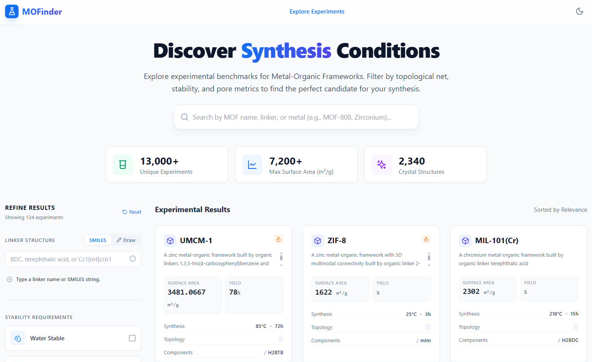
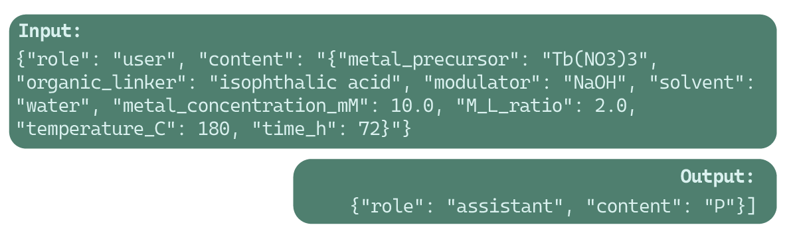

# MOFinder

MOFinder extracts MOF synthesis information from the literature, reconstructs evidence-supported negative reaction records, and prepares datasets for synthesis-outcome prediction.

<p align="center">
  
</p>

[Web application](https://mofinder.chemistry.wustl.edu/) | [Demos](Demo/README.md) | [Source code](docs/source_to_code.md) | [Workflow guide](docs/workflow.md) | [Model evaluation](docs/evaluation.md)

## Quick start

The workflow runs through Python commands. Python 3.10 or newer is required. Clone the repository and initialize its related applications:

```bash
git clone --recurse-submodules https://github.com/zzhenglab/MOFinder.git
cd MOFinder
```

Start with the two offline demonstrations:

```bash
python -m pip install -e ".[curation,datasets]"
python Demo/01_data_curation/mof_data_curation_demo.py --check
python Demo/02_dataset_preparation/mof_dataset_preparation_demo.py --positive-csv Demo/01_data_curation/outputs/mof_extraction_6.csv --check
```

These regenerate processed synthesis records and prepare grouped training and holdout JSONL. `--check` compares the files with the bundled expected outputs. The [data mining demo (API required)](Demo/03_api_data_mining/README.md) combines abstract triage, positive extraction, and negative reconstruction.

For API-based extraction, install `.[mining,notebook]` and open the [data mining notebook](Demo/03_api_data_mining/mof_api_data_mining_demo.ipynb). Its preview cells show the inputs before live requests are enabled. See [installation](docs/installation.md) for dependencies and credentials, and the [triage guide](docs/triage.md) for screening and saved-run analysis.

## Source code

Reusable Python modules are in [`src/mofinder/`](src/mofinder/). The [source code map](docs/source_to_code.md) links each workflow to its implementation and instructions; [earlier research scripts](docs/legacy_workflow.md) are indexed separately.

## Choose a workflow

| Task | Start here |
| --- | --- |
| Run data curation and dataset preparation | [Offline demos](Demo/README.md) |
| Try abstract triage, positive extraction, and negative reconstruction | [API data mining demo](Demo/03_api_data_mining/README.md) |
| Screen abstracts and analyze saved predictions | [Abstract triage](docs/triage.md) |
| Download articles and supporting information | [Literature retrieval](docs/literature_retrieval.md) |
| Match documents and extract synthesis records | [Workflow guide](docs/workflow.md) |
| Curate records and prepare training and holdout JSONL | [Data curation](docs/curation.md) and [dataset preparation](docs/datasets.md) |
| Look up chemical names and SMILES | [Mapping tables](data/name_SMILES_mappers/README.md) |
| Inspect processed records and publication metadata | [Processed data](data/processed_data/README.md) |
| Explore synthesis-condition distributions | [Dataset analysis](docs/dataset_analysis/README.md) |
| Inspect training datasets and ablations | [JSONL datasets](data/processed_data_json/README.md) |
| Add vessel type, volume, and agitation to model inputs | [Eleven-field process-enriched dataset](data/processed_data_json/processed_enrich_11field/README.md) |
| Add only reported stirring to model inputs | [Nine-field process-enriched dataset](data/processed_data_json/processed_enrich_9field/README.md) |
| Train a model | [OpenAI interface](docs/training_openai.md) or [HPC workflow](docs/training_hpc.md) |
| Evaluate models and human predictions | [Evaluation workflow](docs/evaluation.md) |

## Repository layout

| Location | Contents |
| --- | --- |
| `src/mofinder/literature/` | Input validation, screening, document matching, and local document counts |
| `src/mofinder/literature_retrieval/` | Article and SI desktop applications, configuration loading, and inventory handling |
| `src/mofinder/extraction/` | Positive extraction, JSON recovery, negative plans, and enumeration |
| `src/mofinder/curation/` | Chemical normalization, amount conversion, process details, and ablation datasets |
| `src/mofinder/datasets/` | Condition-classification records, grouped splits, and training JSONL |
| `src/mofinder/training/` | Single-dataset training input preparation and HPC fine-tuning |
| `src/mofinder/evaluation/` | Triage statistics, reaction holdout/model evaluation, and human benchmark analysis |
| `src/mofinder/plotting/` | Dataset distributions, pairwise condition coverage, publisher coverage, and triage evaluation figures |
| `configs/` and `prompts/` | Named settings and prompt text |
| `data/` | Input manifests, metadata, organic linker information, dataset snapshots, and split records |
| `data/processed_data/` | Processed positive and negative CSVs, publication metadata, retrieval inventories, and a linker-corrected alternative |
| `data/processed_data_json/` | Final training and holdout JSONL with record assignments, split summary, and class map |
| `benchmarks/` | Human references and benchmark-specific documentation |
| `Demo/` | Offline curation, dataset preparation, and executed figure notebooks; API examples for triage, extraction, and reconstruction |
| `docs/` | Installation, workflow guides, source provenance, and reproduction instructions |
| `tools/literature_retrieval/` | Entry points for optional desktop download tools |
| `tools/training/` | Training-bundle preparation and GPU training entry points |
| `tests/` | Automated checks of workflows, splitting, and data integrity, run by GitHub Actions |

## Data and reproducibility

| File | Contents | Records |
| --- | --- | ---: |
| [`data/processed_data/processed_positive.csv`](data/processed_data/processed_positive.csv) | Positive records after curation, before dataset filtering | 15,340 |
| [`data/processed_data/processed_negative.csv`](data/processed_data/processed_negative.csv) | Reconstructed negative records after curation, before dataset filtering | 15,063 |
| [`data/processed_data/linker_corrected/processed_negative.csv`](data/processed_data/linker_corrected/README.md) | Same negative records with source-confirmed linker prime symbols restored | 15,063 |
| [`data/processed_data_json/train.jsonl`](data/processed_data_json/train.jsonl) | Training set: 11,968 P and 11,560 N | 23,528 |
| [`data/processed_data_json/holdout.jsonl`](data/processed_data_json/holdout.jsonl) | Holdout set: 1,320 P and 1,275 N | 2,595 |
| [`data/processed_data_json/split_assignments.csv`](data/processed_data_json/split_assignments.csv) | Source-row assignments for the retained training and holdout records | 26,123 |


<p align="center">
  
</p>
Training and holdout records use chat-format JSONL. Each record contains a system instruction, a user message with eight reaction-condition fields, and an assistant answer of `P` or `N`.


### Reproduce the JSONL datasets

The default [dataset configuration](configs/dataset_preparation.json) reads `processed_positive.csv`, `processed_negative.csv`, and `publication_years.csv` from `data/processed_data/`. Regenerate their final JSONL and split records locally with:

```bash
python -m mofinder.datasets.prepare validate --config configs/dataset_preparation.json
python -m mofinder.datasets.prepare prepare --config configs/dataset_preparation.json
```

This writes to `results/datasets/conditions/`. To prepare a dataset after running curation, use [dataset_preparation_from_curation.json](configs/dataset_preparation_from_curation.json), which writes to `results/datasets/curated_conditions/`.

Input hashes and transformations are recorded in [data/manifest.json](data/manifest.json). Generated run outputs are saved under `results/`, which is excluded from Git.

## Related applications

- `WebApplication/`: MOFinder web interface.
- `MOF-Quest/`: reaction-prediction game.
- `SMILESearcher/`: chemical name-to-SMILES resolution and molecular-weight calculation.

Initialize these Git submodules when needed:

```bash
git submodule update --init --recursive
```

## Open-weight model

The [GPT-oss-MOF checkpoint](https://huggingface.co/StarLiu714/GPT-oss-MOF) is available for local synthesis-outcome prediction. Local inference requires hardware suitable for a 20B-parameter model. The checkpoint is optional; data curation and dataset preparation run on a CPU without model downloads.

## Citation and license

Software citation metadata is provided in [CITATION.cff](CITATION.cff). The MOFinder code uses the [MIT License](LICENSE); submodules retain their own licenses.
