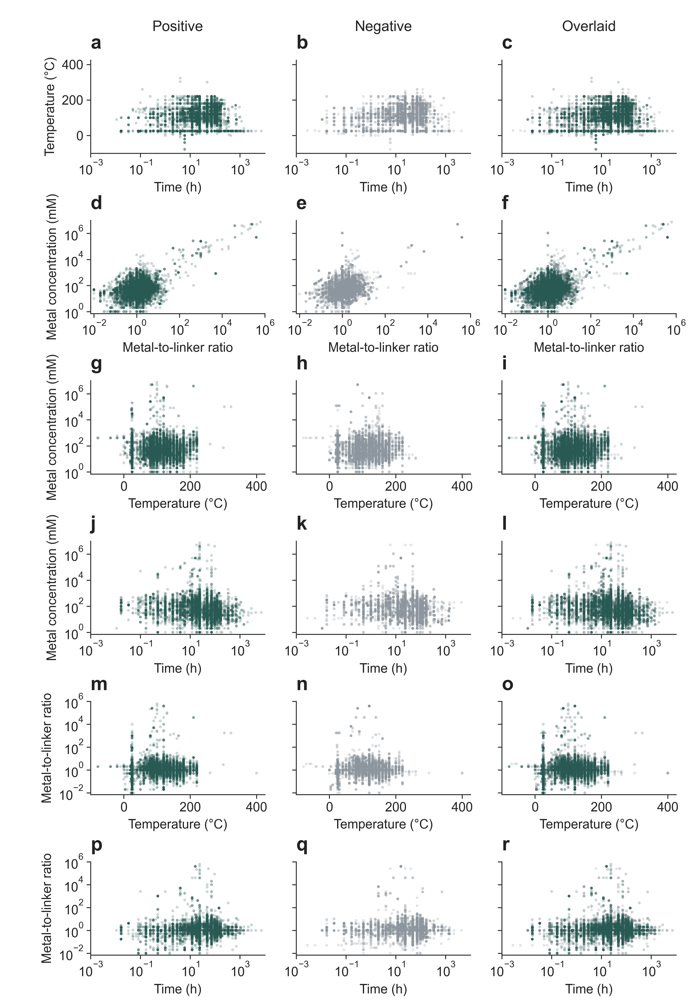
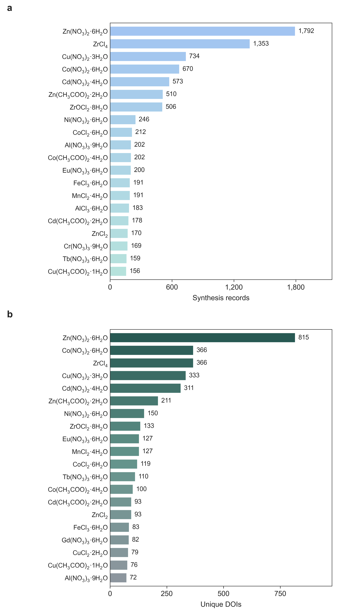
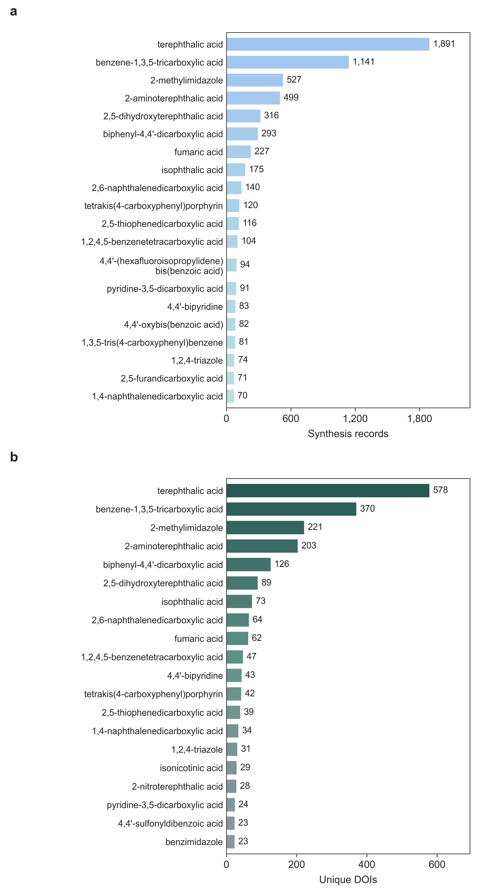
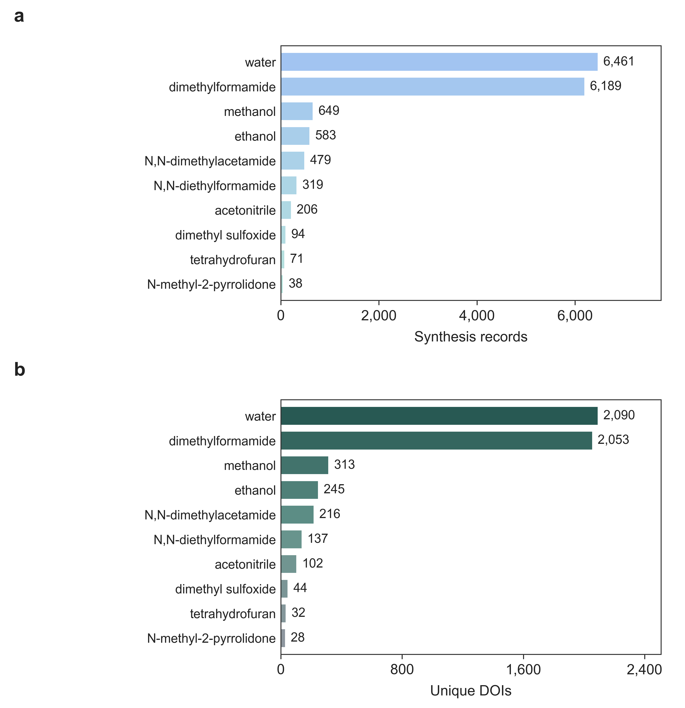
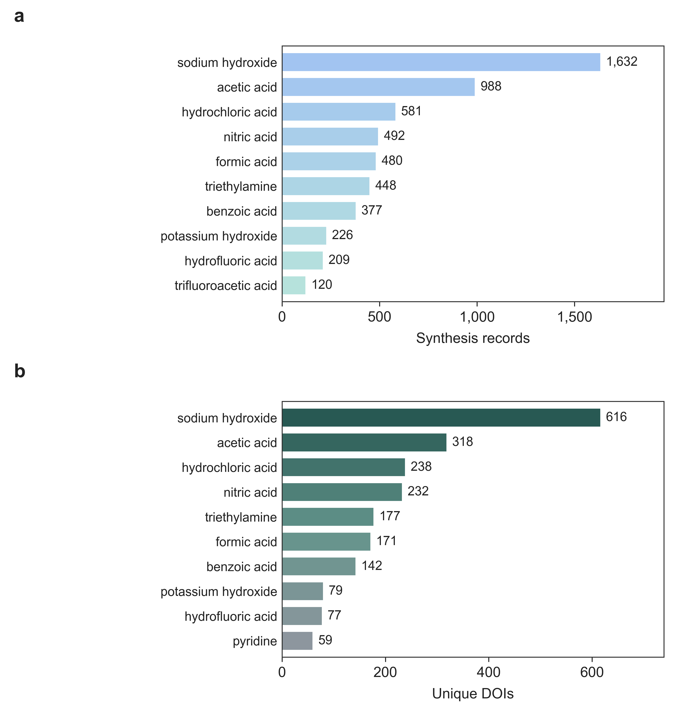
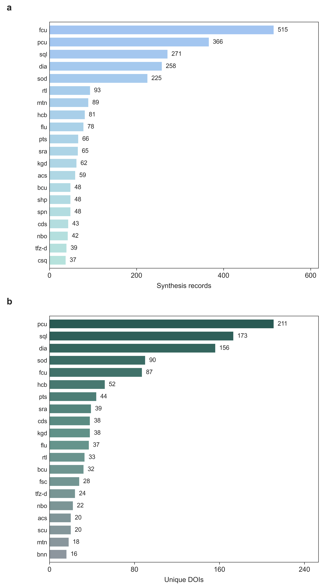
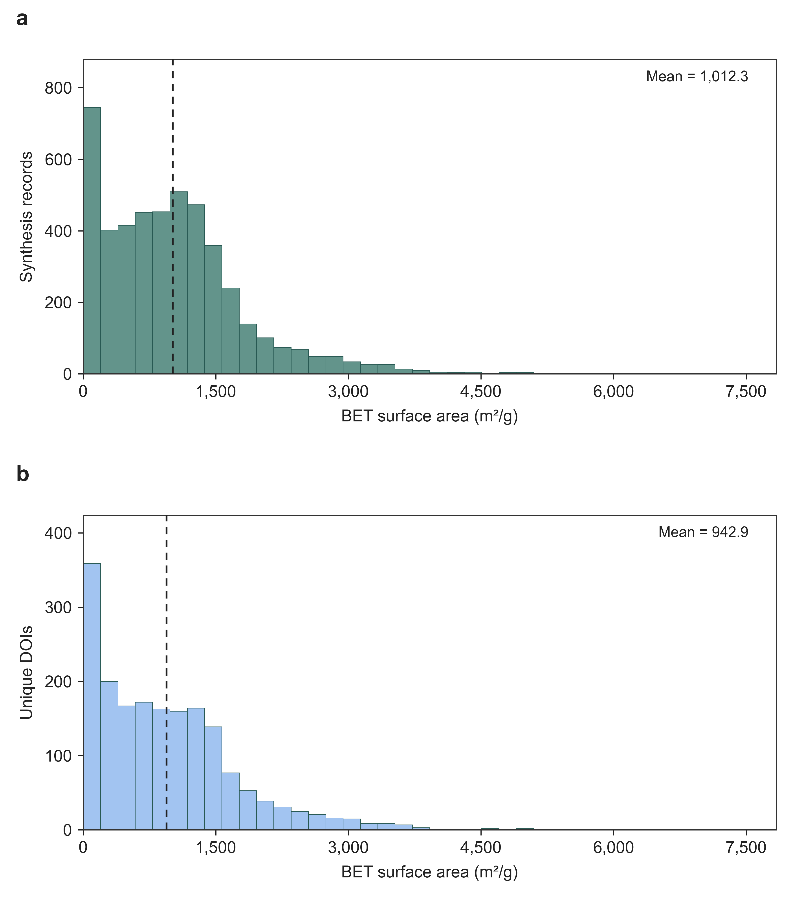
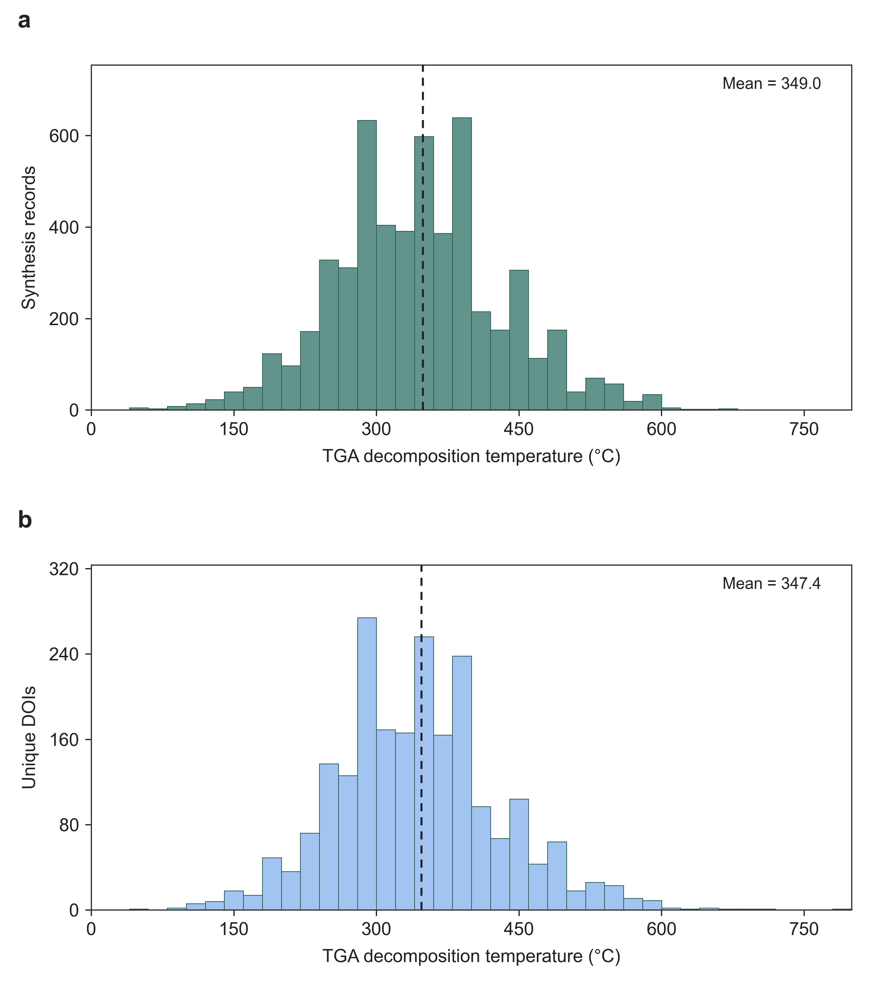
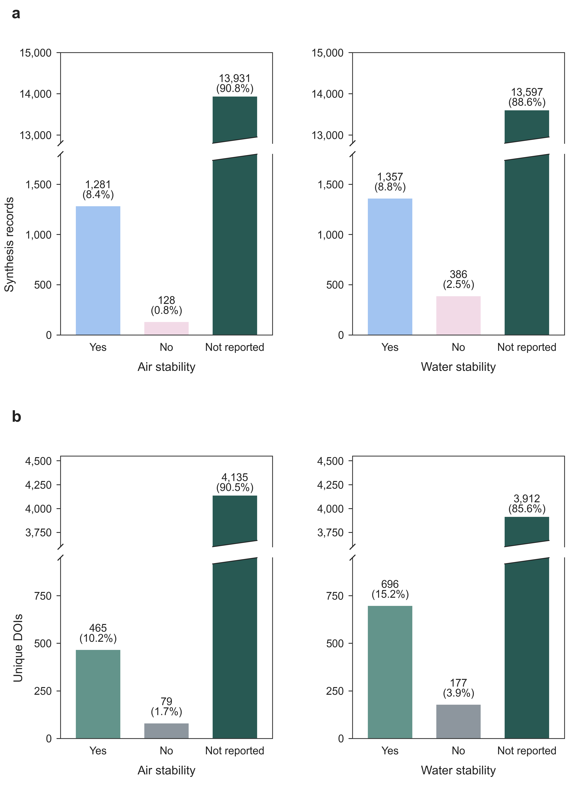
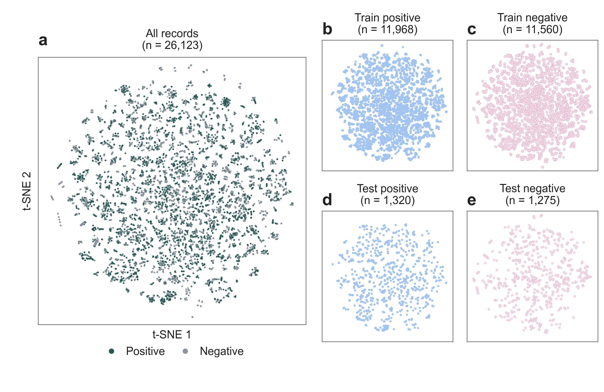

# Dataset analysis

The [executed notebook](../../Demo/04_dataset_analysis/dataset_analysis.ipynb) draws the figures below from the included datasets. Composition and property summaries use the positive dataset; pairwise plots use both datasets; t-SNE shows the final training and test records.

| Dataset | Records |
| --- | ---: |
| [Positive](../../data/processed_data/processed_positive.csv) | 15,340 |
| [Negative](../../data/processed_data/processed_negative.csv) | 15,063 |
| [Training](../../data/final_json/train.jsonl) | 23,528 |
| [Test / holdout](../../data/final_json/holdout.jsonl) | 2,595 |

## Figures

### Pairwise synthesis-condition coverage



Figure D1. Pairwise distributions of synthesis conditions. Columns show positive records, negative records, and their overlay; marker opacity reflects coincident records.



Figure D2. Frequencies of the 20 most common primary metal precursors, with hydrate identities counted separately. a, Synthesis records. b, Unique DOI counts per precursor.



Figure D3. Frequencies of the 20 most common primary linkers. a, Synthesis records. b, Unique DOI counts per linker.



Figure D4. Frequencies of the 10 most common main solvents. a, Synthesis records. b, Unique DOI counts per solvent.



Figure D5. Frequencies of the 10 most common primary modulators. a, Synthesis records. b, Unique DOI counts per modulator.



Figure D6. Frequencies of the 20 most common topology codes. a, Synthesis records. b, Unique DOI counts per topology.



Figure D7. Histograms of BET surface area. a, Synthesis records. b, Median value per DOI. Dashed lines mark the means.



Figure D8. Histograms of TGA decomposition temperature. a, Synthesis records. b, Median value per DOI. Dashed lines mark the means.



Figure D9. Air and water stability labels, including Not reported. a, Synthesis records. b, Unique DOI counts per label. Diagonal marks indicate omitted count intervals.

### Training and test t-SNE visualization



Figure D10. t-SNE visualization of synthesis records. a, Combined dataset. b, Positive training records. c, Negative training records. d, Positive test records. e, Negative test records. All panels share coordinates and axis limits.

## Methods and outputs

Figures D2–D9 show synthesis records above unique DOI counts. A DOI counts once per category; categories may overlap and are ranked separately. Property panels use each DOI's median eligible value. Blank categories are omitted except for stability, where they count as Not reported. Reported properties use the positive dataset, so inherited negative-record properties are not counted as additional measurements.

Hydrate identities remain separate; modulator aliases and topology labels use the rules in [the plotting module](../../src/mofinder/plotting/dataset_analysis.py). BET values must be nonnegative and TGA temperatures at least −273.15 °C; missing and nonfinite values are omitted. Pairwise plots retain finite values, require positive values on logarithmic axes, and show overlap through marker opacity. t-SNE uses eight condition descriptors from training and test records, with shared [coordinates](data/tsne_coordinates.csv) across panels; outcome labels are used only for display.

Figures are 6 inches wide at 600 dpi, with Arial 8–10 pt text and bold 12 pt panel labels; an available sans-serif font is used if Arial is absent. [Captions](CAPTIONS.md), [record-only figures](figures/01_synthesis_records/), [record/DOI figures](figures/02_records_and_DOI/), [summary statistics](summary.json), and [plotting tables](tables/) are included. The [pairwise count table](tables/D1_pairwise_coverage_counts.csv) reports coverage for each parameter pair.

## Reproduce

From the repository root:

```bash
python -m pip install -e ".[plotting,notebook]"
python -m mofinder.plotting.dataset_analysis
python -m mofinder.plotting.condition_coverage
python -m mofinder.plotting.split_embedding
```

Outputs go to `results/dataset_analysis/`. Each command accepts `--output docs/dataset_analysis` to refresh the documentation figures. To recalculate t-SNE, install `pip install -e ".[embedding]"` and add `--refit` to the split-embedding command. The notebook displays ten figures and exports eighteen PNGs, including both versions of Figures D2–D9.
