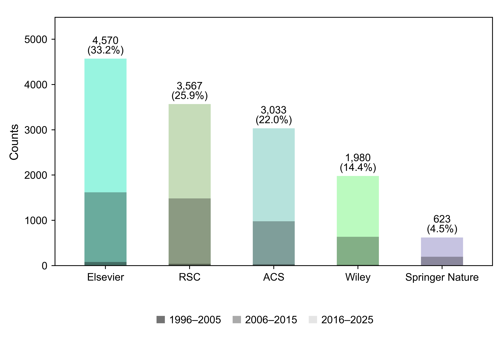

# Dataset analysis

The [executed notebook](../../Demo/04_dataset_analysis/dataset_analysis.ipynb) draws the figures below from the included datasets. Composition and property summaries use the positive dataset; pairwise plots use both datasets; t-SNE shows the final training and test records.

| Dataset | Records |
| --- | ---: |
| [Positive](../../data/processed_data/processed_positive.csv) | 15,340 |
| [Negative](../../data/processed_data/processed_negative.csv) | 15,063 |
| [Training](../../data/final_json/train.jsonl) | 23,528 |
| [Test / holdout](../../data/final_json/holdout.jsonl) | 2,595 |

## Figures

### Pairwise synthesis-condition coverage


### Primary metal precursors


### Primary linkers


### Main solvents


### Primary modulators


### Topology


### BET surface area


### TGA decomposition temperature


### Air and water stability


### Training and test t-SNE visualization


### Literature coverage



## Methods and outputs

Composition, property, and stability plots show synthesis records above DOI summaries. A DOI counts once per category; property panels use each DOI's median eligible value. Blank categories are omitted except for stability, where they count as Not reported. These summaries use the positive dataset.

Hydrate identities remain separate. Missing and nonfinite property values are omitted. Pairwise plots use both datasets, with opacity showing coincident records. t-SNE uses eight condition descriptors and shared [coordinates](data/tsne_coordinates.csv); outcome labels are used only for display. [Publisher counts](../triage_figures/README.md) include all bibliography records before triage.

Figures are 6 inches wide at 600 dpi, with Arial 8–10 pt text and bold 12 pt panel labels. [Captions](CAPTIONS.md), [record-only figures](figures/01_synthesis_records/), [record/DOI figures](figures/02_records_and_DOI/), [summary statistics](summary.json), and [plotting tables](tables/) are included.

## Reproduce

From the repository root:

```bash
python -m pip install -e ".[plotting,notebook]"
python -m mofinder.plotting.dataset_analysis
python -m mofinder.plotting.condition_coverage
python -m mofinder.plotting.split_embedding
python -m mofinder.plotting.literature_triage_figures --source docs/triage_figures/publisher_source_records.csv --mapping docs/triage_figures/publisher_name_mapping.csv --output-dir results/dataset_analysis/literature
```

Outputs go to `results/dataset_analysis/`. To recalculate t-SNE, install `pip install -e ".[embedding]"` and add `--refit` to the split-embedding command. The notebook displays every figure and exports both synthesis-record and record/DOI versions where applicable.
