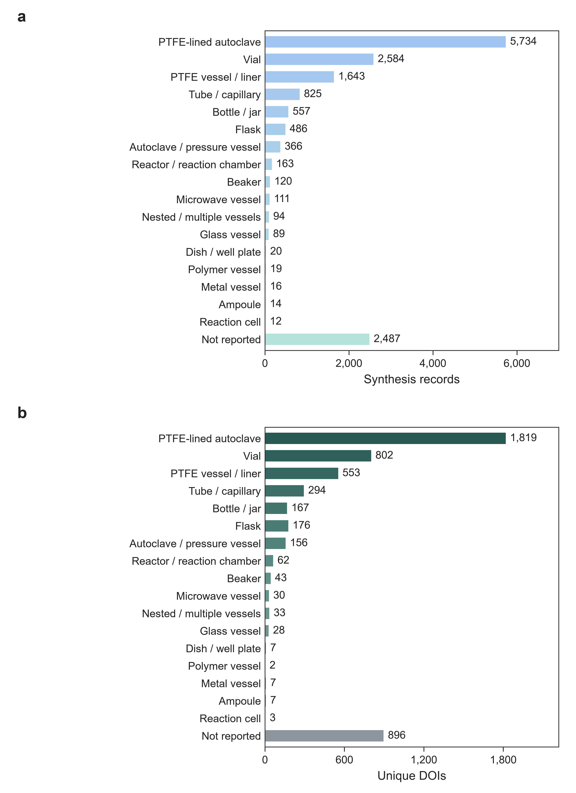
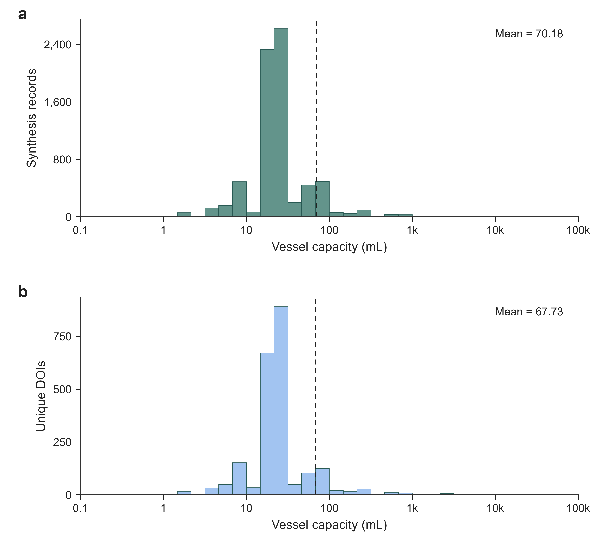
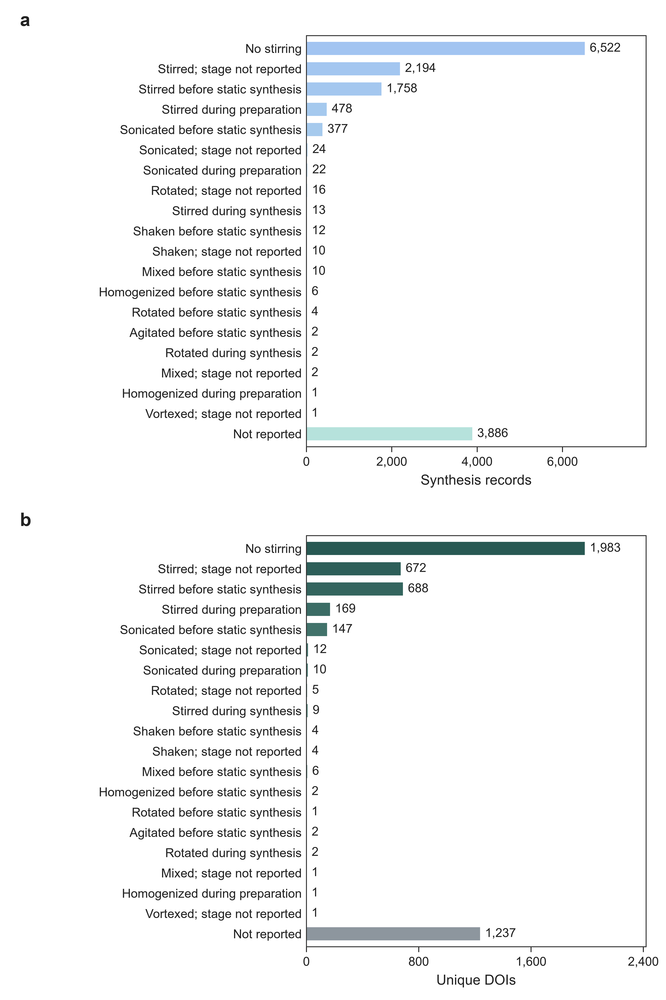

# Process-detail distributions

These plots summarize the cleaned vessel type, vessel capacity, and agitation fields for all 15,340 [positive synthesis records](../../data/processed_data/with_process_details/README.md) from 4,568 DOIs, before training-data filtering. Panel **a** shows synthesis records; panel **b** shows unique DOIs. The same categories are used in the [process-enriched JSONL files](../../data/processed_data_json/processed_enrich/README.md).

## Figures

PTFE-lined autoclaves are the most common vessel type. Missing types and selected rare vessel categories are recorded as `Not reported`. A DOI can contribute to several categories.

<a href="figures/process_enrich_vessel_type.png"></a>

Numeric vessel capacities are available for 7,271 records (47.4%). The DOI panel uses one median capacity per DOI; dashed lines show arithmetic means. Missing and ambiguous capacities are omitted.

<a href="figures/process_enrich_vessel_volume.png"></a>

Agitation categories distinguish stirring, sonication, related mechanical methods, and unreported conditions. Preparatory stirring precedes the main synthesis step; `Stirred before static synthesis` requires an explicitly static subsequent stage. `Stirring reported` leaves the stage unspecified.

<a href="figures/process_enrich_agitation.png"></a>

[Category counts](category_counts.csv) · [Capacity histogram counts](volume_histogram_counts.csv) · [Counting methods](DISTRIBUTION_METHODS.md)

Recreate the PNGs and calculation tables from the repository root:

```bash
python tools/plot_process_details.py --output results/process_details/figures --report-dir results/process_details/reports
```
