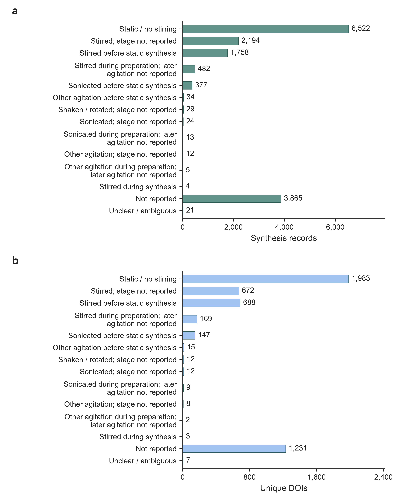

# Process-detail distributions

These figures summarize the complete [positive process-detail dataset](../../data/processed_data/with_process_details/README.md). Panel a counts synthesis records and sits above panel b, which counts unique DOIs. The panels follow the temperature/time figures: muted teal for records and light blue for DOIs, with dark teal outlines. Categorical plots retain the same category order in both panels and show counts beside the bars. Missing and ambiguous process fields retain their rows. [Methods](DISTRIBUTION_METHODS.md), [counts](category_counts.csv), [coverage](field_coverage.csv), and [provenance](distribution_summary.json) accompany the figures.

## Vessel types


## Vessel capacities


## Stirring descriptions



PNG, PDF, and SVG exports are in [figures](figures/), with [records-only](figures/01_synthesis_records/) and [records-plus-DOI](figures/02_records_and_DOI/) versions. The vessel-capacity histograms use accepted numerical capacities and one median capacity per DOI in panel b; dashed lines mark arithmetic means. The [manuscript subsection](Section_S5_process_details.md) and [captions](FIGURE_CAPTIONS.md) describe this optional control. Both positive and negative process-detail datasets remain available for training; the figures display the positive dataset only. No model-performance improvement has been assumed.

Regenerate from the repository root:

```bash
python tools/plot_process_details.py
```

See the [matched training preparation](../process_enrich_training.md) for the enriched JSONL and revised prompt.
