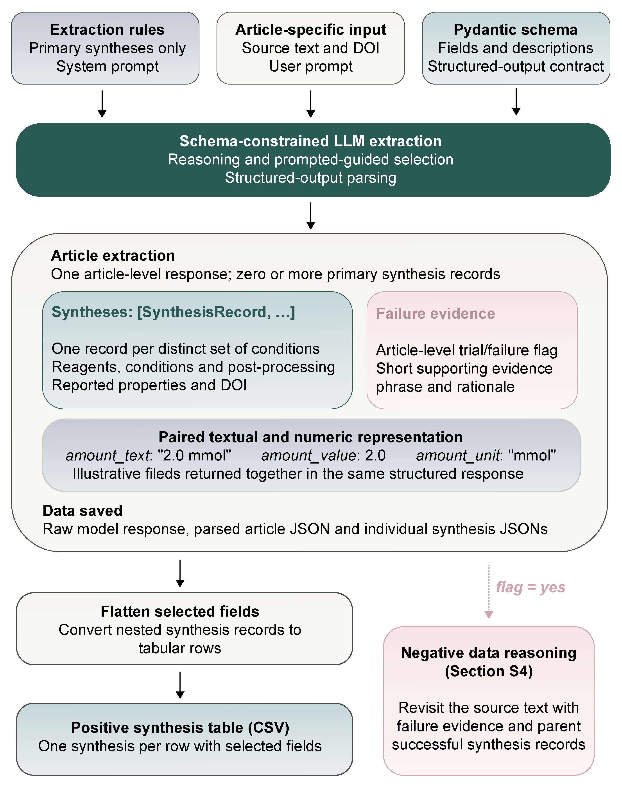
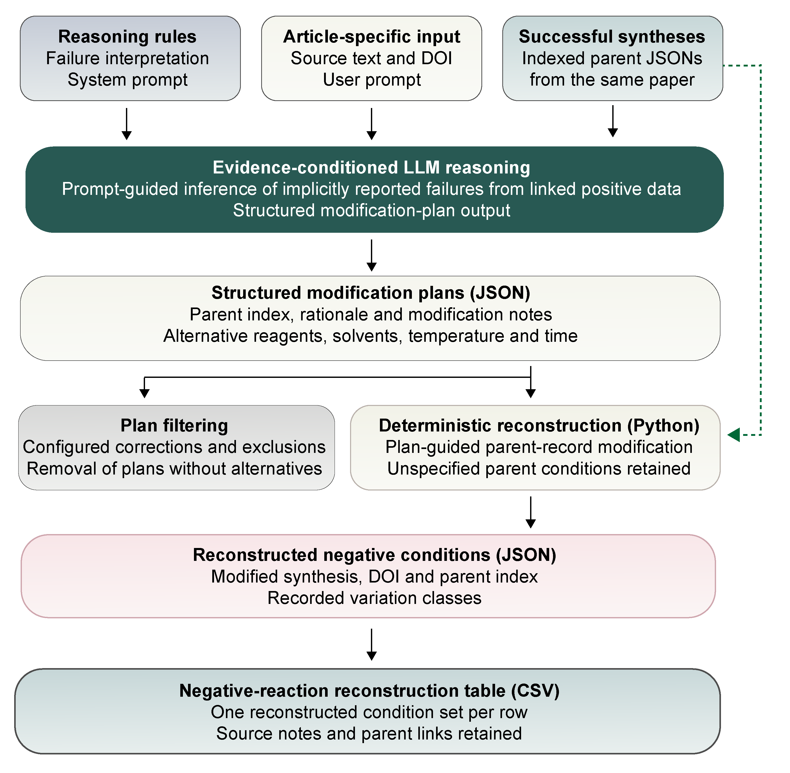

# Workflow illustrations

See the [workflow guide](../workflow.md) for runnable commands.

## Positive synthesis extraction

**Note:** Section S4 refers to the [negative data mining workflow](#negative-condition-reconstruction).

## Negative-condition reconstruction

Negative records reconstruct conditions from linked positive syntheses and failure evidence. Enumerated combinations and inherited properties are not independent experimental measurements.

For the corresponding implementation, see the [source code map](../source_to_code.md) and [extraction package](../../src/mofinder/extraction/).
